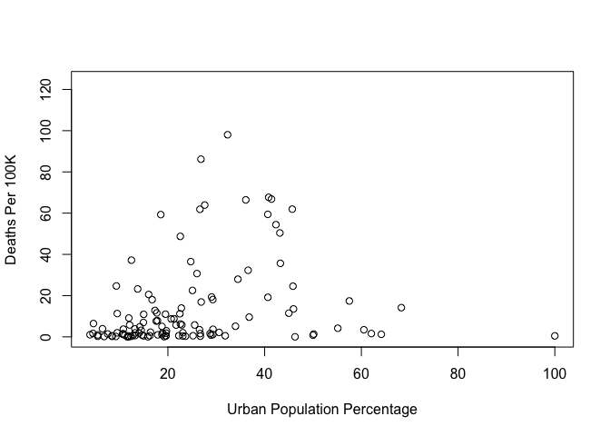

Midterm Assignment, ME314 2024
================

``` r
usethis::use_git_config(user.name="angelinewang", user.email="02angelinewang@gmail.com")
```

#### Summer School 2024 midsession examination

# ME314 Introduction to Data Science and Machine Learning

## Suitable for all candidates

### Instructions to candidates

- Complete the assignment by adding your answers directly to the
  RMarkdown document, knitting the document, and submitting the HTML
  file to Moodle.  
- Submit the assignment via
  [Moodle](https://shortcourses.lse.ac.uk/course/view.php?id=158).
- Deadline: Wednesday 17th July, 2pm.

## Question 1 (70 points)

This question should be answered using the `covid_country_data.csv` data
set. This data contains observations from 180 countries, and includes
information on various indicators which might be predictive of the
severity of the COVID-19 pandemic in each country. The data includes the
following variables:

| Variable name     | Description                                                                                                                                     |
|:------------------|:------------------------------------------------------------------------------------------------------------------------------------------------|
| `countryiso3`     | Unique country identifier                                                                                                                       |
| `country`         | Country name                                                                                                                                    |
| `deaths_per_100k` | Total number of deaths recorded from COVID-19 per 100,000 people in the population                                                              |
| `female_leader`   | `TRUE` if the country has a female president or prime minister and `FALSE` otherwise                                                            |
| `ghs_index`       | The Global Health Security index score, a 2019 measure that aimed to predict how prepared each country was for handling epidemics and pandemics |
| `gdp_percap`      | GDP per capita in current US dollars, measured in 2016                                                                                          |
| `pct_urban`       | The percentage of the population living in urban agglomerations of more than 1 million, measured in 2016                                        |
| `health_gdp_pct`  | Current health expenditure as a percentage of GDP, measured in 2016                                                                             |
| `democracy`       | `TRUE` if the country is a democracy and `FALSE` otherwise (Polity IV, dichotomised at 6)                                                       |
| `continent`       | The continent in which the country is located                                                                                                   |

You can run the following line of code in R and this will load the data
directly from the course website:

``` r
library(dplyr)
```

    ## 
    ## Attaching package: 'dplyr'

    ## The following objects are masked from 'package:stats':
    ## 
    ##     filter, lag

    ## The following objects are masked from 'package:base':
    ## 
    ##     intersect, setdiff, setequal, union

``` r
library(ggplot2)
library(tidyverse)
```

    ## ── Attaching core tidyverse packages ──────────────────────── tidyverse 2.0.0 ──
    ## ✔ forcats   1.0.0     ✔ stringr   1.5.1
    ## ✔ lubridate 1.9.3     ✔ tibble    3.2.1
    ## ✔ purrr     1.0.2     ✔ tidyr     1.3.1
    ## ✔ readr     2.1.5

    ## ── Conflicts ────────────────────────────────────────── tidyverse_conflicts() ──
    ## ✖ dplyr::filter() masks stats::filter()
    ## ✖ dplyr::lag()    masks stats::lag()
    ## ℹ Use the conflicted package (<http://conflicted.r-lib.org/>) to force all conflicts to become errors

``` r
covid_data <- read.csv("https://raw.githubusercontent.com/lse-me314/lse-me314.github.io/master/data/covid_country_data.csv")
```

#### a. Create a scatterplot of the `pct_urban` (x-axis) and `deaths_per_100k` (y-axis) variables in the data. Provide proper axis labels. Interpret the graph and report the correlation between these variables (if there is missing data, then you might need to include the `use = "complete.obs"` argument in the `cor()` function).

``` r
plot(covid_data$pct_urban, covid_data$deaths_per_100k,
  xlab = "Urban Population Percentage", 
  ylab = "Deaths Per 100K")
```

<!-- -->

``` r
cor(covid_data$pct_urban, covid_data$deaths_per_100k, use = "complete.obs")
```

    ## [1] 0.2454198

``` r
## The graph shows that the data is not linear, there is heteroscedasticity, and the most notable outlier has 100% urban population percentage, which is Singapore, along with a very low deaths per 100 thousand people. The correlation between the variables in 0.2454198. This shows a positive relationship between the urban population percentage and deaths per 100 thousand people, indicating that as the percentage of the urban population increases, the number of deaths per 100 thousand also tends to increase. This number also indicates a weak to moderate positive correlation.
## The scatter plot shows the relationship between the urban population percentage and the deaths per 100 thousand people. The x-axis shows the percentage of the population that lives in urban areas with values ranging from 0 to 100. And the y-axis shows the number of deaths per 100 thousand people, with values from 0 to over 60.
## Most of the data is clustered to the left of the graph, which shows that a lot of countries have a smaller urban population percentage, notably between 0 and 40%. 
## The deaths per 100 thousand people also varies dramatically even across countries possessing smaller urban population percentages, with values from 0 to over 60.
## A countries in the graph are shown to have high urban population percentages, ones over 60%, along with a relatively small number of deaths per 100 thousand people, meaning these are possible outliers. 
## The spread of the data points has a slight upward trend, which is indicative of the positive correlation coefficient. 
```

#### b. Fit a regression model predicting `deaths_per_100k` using `pct_urban` and `female_leader` as predictors. Interpret the coefficients and the $R^2$ from the regression (by explaining each in a few statements).

``` r
lm_covid_data <- lm(deaths_per_100k ~ pct_urban + female_leader, data = covid_data)
summary(lm_covid_data)
```

    ## 
    ## Call:
    ## lm(formula = deaths_per_100k ~ pct_urban + female_leader, data = covid_data)
    ## 
    ## Residuals:
    ##     Min      1Q  Median      3Q     Max 
    ## -36.513 -10.570  -7.037   1.705  81.846 
    ## 
    ## Coefficients:
    ##                   Estimate Std. Error t value Pr(>|t|)   
    ## (Intercept)         5.7883     3.5881   1.613  0.10949   
    ## pct_urban           0.3216     0.1194   2.693  0.00815 **
    ## female_leaderTRUE  -0.9729     5.3284  -0.183  0.85545   
    ## ---
    ## Signif. codes:  0 '***' 0.001 '**' 0.01 '*' 0.05 '.' 0.1 ' ' 1
    ## 
    ## Residual standard error: 20.29 on 113 degrees of freedom
    ##   (64 observations deleted due to missingness)
    ## Multiple R-squared:  0.06051,    Adjusted R-squared:  0.04388 
    ## F-statistic: 3.639 on 2 and 113 DF,  p-value: 0.02941

``` r
## The intercept, at 5.7883, is the estimated deaths per 100k while the pcr_urban is 0, and female_leader = FALSE. This coefficient may not be practically useful in real-world scenarios because it is unlikely that pct_urban will equal 0, this estimate acts as the baseline. 
## Keeping all other variables constant, for every 1 percentage increase of pct_urban, there is 0.3216 more deaths per 100k people. The impact of pct_urban is statistically significant on deaths per 100k because the p-value is 0.00815, which is smaller than 0.05. 
## Keeping all other variables constant, having a female leader leads to 0.9729 less deaths per 100K people. The impact of whether the country has a female leader is not statistically significant because the p-value is 0.85545, which is larger than 0.05.
## The multiple r-squared shows a 6.051% variability observed in the number of deaths per 100k is explained by the regression model of percentage urban and female leader. This indicates that the model cannot account for a large amount of variability in the response variable, meaning that additional factors not included in the model could be impacting the result.
```

#### c. Fit a second model which includes the *interaction* between `pct_urban` and `female_leader`. Interpret the coefficients in this new model. Does the effect of `pct_urban` depend on whether a country has a female president or prime minister?

``` r
interaction_covid_data <- lm(deaths_per_100k ~ pct_urban + female_leader + pct_urban:female_leader, covid_data)

summary(interaction_covid_data)
```

    ## 
    ## Call:
    ## lm(formula = deaths_per_100k ~ pct_urban + female_leader + pct_urban:female_leader, 
    ##     data = covid_data)
    ## 
    ## Residuals:
    ##     Min      1Q  Median      3Q     Max 
    ## -28.117 -10.218  -6.957   1.277  81.278 
    ## 
    ## Coefficients:
    ##                             Estimate Std. Error t value Pr(>|t|)   
    ## (Intercept)                   3.9450     3.9857   0.990  0.32441   
    ## pct_urban                     0.3961     0.1385   2.860  0.00506 **
    ## female_leaderTRUE             6.2805     8.6723   0.724  0.47045   
    ## pct_urban:female_leaderTRUE  -0.2891     0.2728  -1.060  0.29154   
    ## ---
    ## Signif. codes:  0 '***' 0.001 '**' 0.01 '*' 0.05 '.' 0.1 ' ' 1
    ## 
    ## Residual standard error: 20.28 on 112 degrees of freedom
    ##   (64 observations deleted due to missingness)
    ## Multiple R-squared:  0.06984,    Adjusted R-squared:  0.04492 
    ## F-statistic: 2.803 on 3 and 112 DF,  p-value: 0.04313

``` r
## To interpret the coefficients: The intercept, at 3.9450, is the estimated deaths per 100k while the pcr_urban is 0, and female_leader = FALSE. This coefficient may not be practically useful in real-world scenarios because it is unlikely that pct_urban will equal 0, this estimate acts as the baseline. 
## Provided that female_leader = 0, a one unit increase in pcr_urban is, on average, associated with 0.3961 units increase in deaths per 100k.
## Provided that female_leader = 1, a one unit increase in pcr_urban is, on average, associated with 0.107 units increase in deaths per 100k.
## This means that the impact of pct_urban on deaths per 100k is lower for countries possessing a female leader in comparison to those without a female leader. 
## Although the effect of the pct_urban on deaths_per_100k does depend on whether a country has a female leader, this interaction is not statistically significant because p = 0.29154.  
```

#### d. Are either of the two models you estimated preferable as a predictive model? Why?

``` r
## In order to determine the preferable predictive model, we must find the model with the larger adjusted r-squared and lower residual standard error. The model with the interaction variable has an adjusted r-squared of 0.04492, which is greater than the 0.04388 adjusted r-squared of the model without the interaction variable. This means that the second model with the interaction variable is preferable as a predictive model. The RSE of the first model is larger as it is 20.29, and the second model has a RSE of 20.28, which means that the second is more accurate. However, the difference between the two models is very minimal. 
```

#### e. Pick one further explanatory variable from the data to include in addition to the variables included in your answer to question (c). Interpret the relevant coefficient(s) on the new variable that you include and describe whether your new model improves on the predictive power of the two previous models.

``` r
newvariable_covid_data <- lm(deaths_per_100k ~ pct_urban + female_leader + pct_urban:female_leader + gdp_percap, covid_data)

summary(newvariable_covid_data)
```

    ## 
    ## Call:
    ## lm(formula = deaths_per_100k ~ pct_urban + female_leader + pct_urban:female_leader + 
    ##     gdp_percap, data = covid_data)
    ## 
    ## Residuals:
    ##     Min      1Q  Median      3Q     Max 
    ## -31.607  -8.932  -6.147   1.035  83.153 
    ## 
    ## Coefficients:
    ##                               Estimate Std. Error t value Pr(>|t|)  
    ## (Intercept)                  4.1798832  3.9282996   1.064   0.2897  
    ## pct_urban                    0.2770166  0.1470508   1.884   0.0623 .
    ## female_leaderTRUE            1.8339428  8.7445963   0.210   0.8343  
    ## gdp_percap                   0.0002808  0.0001210   2.322   0.0221 *
    ## pct_urban:female_leaderTRUE -0.2850350  0.2688238  -1.060   0.2914  
    ## ---
    ## Signif. codes:  0 '***' 0.001 '**' 0.01 '*' 0.05 '.' 0.1 ' ' 1
    ## 
    ## Residual standard error: 19.98 on 109 degrees of freedom
    ##   (66 observations deleted due to missingness)
    ## Multiple R-squared:  0.1164, Adjusted R-squared:  0.08393 
    ## F-statistic: 3.588 on 4 and 109 DF,  p-value: 0.008667

``` r
## My new model does improve the predictive power of the two previous models because the increase in accuracy is significant. Due to the lower RSE, higher multiple R-squared and higher adjusted r-squared, my model proves to provide a better fit to the data, explaining more of the variability in deaths per 100k and creating more accurate predictions. However, this could also indicate overfitting in my model, and may not be representative of how my model will perform on unseen data compared to the first model. 
```

## Question 2 (30 points)

Can we predict whether individuals would like their country to leave the
European Union? This question uses a dataset which includes several
variables taken from the 2016 European Social Survey
[(https://www.europeansocialsurvey.org)](https://www.europeansocialsurvey.org).
The unit of analysis is individual respondents to a face-to-face survey.
There are a total of 13075 observations in the data, with respondents
surveyed in 17 different European countries.

The data includes the following variables:

| **Variable**        | **Description**                                                                                                                                                                   |
|---------------------|-----------------------------------------------------------------------------------------------------------------------------------------------------------------------------------|
| `country_code`      | The country of the respondent                                                                                                                                                     |
| `leave`             | 1 if the respondent would vote to leave the European Union in a referendum, 0 otherwise                                                                                           |
| `gender`            | Whether the respondent is male or female                                                                                                                                          |
| `age`               | The age of the respondent (in years)                                                                                                                                              |
| `years_education`   | The number of years of education the respondent has completed                                                                                                                     |
| `unemployed`        | 1 if the respondent is unemployed, 0 otherwise                                                                                                                                    |
| `income`            | 1 if the respondent earns above the median income in their country, 0 otherwise                                                                                                   |
| `religion`          | Categorical variable of the religion of the respondent                                                                                                                            |
| `trade_union`       | 1 if the respondent is a member of a trade union, 0 otherwise                                                                                                                     |
| `news_consumption`  | Amount of time the respondent spends reading newspapers/online news each week (in minutes)                                                                                        |
| `trust_people`      | The degree to which the respondent trusts other people (0 = low trust, 10 = high trust)                                                                                           |
| `trust_politicians` | The degree to which the respondent trusts politicians (0 = low trust, 10 = high trust)                                                                                            |
| `past_vote`         | 1 if the respondent voted in the last general election in their country, 0 otherwise                                                                                              |
| `immig_econ`        | The respondent’s view of the economic effects of immigration in their country (0 = Immigration is bad for the economy; 10 = Immigration is good for the economy)                  |
| `immig_culture`     | The respondent’s view of the cultural effects of immigration in their country (0 = Immigration undermines the country’s culture; 10 = Immigration enriches the country’s culture) |
| `country_attach`    | The respondent’s emotional attachment to their country (0 = Not at all emotionally attached; 10 = Very emotionally attached)                                                      |
| `climate_change`    | How worried the respondent is about climate change (1 = Not at all worried; 5 = Very worried)                                                                                     |
| `imp_tradition`     | How important the respondent feels it is to follow traditions and customs (1 = Very important; 6 = Not at all important)                                                          |
| `imp_equality`      | How important the respondent feels it is people are treated equally and have equal opportunities (1 = Very important; 6 = Not at all important)                                   |
| `eu_integration`    | The respondent’s views on European unification/integration (0 = “Unification has already gone too far”; 10 = “Unification should go much further”)                                |
| `train`             | A variable indicating whether the respondent should be used in the training set (`TRUE`) or the test set (`FALSE`).                                                               |

ESS codebook

You can run the following line of code in R and this will load the data
directly from the course website:

``` r
ess <- read.csv("https://raw.githubusercontent.com/lse-me314/lse-me314.github.io/master/data/ess.csv")
```

#### a. Fit a logistic regression with `leave` as the response and with `age`, `gender`, `years_education` and `income` as predictors. Produce a summary of results. For which predictors is the relationship with `leave` statistically significant?

``` r
logistic_model <- glm(leave ~ age + gender + years_education + income, data = ess, family = binomial)

summary(logistic_model)
```

    ## 
    ## Call:
    ## glm(formula = leave ~ age + gender + years_education + income, 
    ##     family = binomial, data = ess)
    ## 
    ## Coefficients:
    ##                  Estimate Std. Error z value Pr(>|z|)    
    ## (Intercept)     -0.927116   0.125971  -7.360 1.84e-13 ***
    ## age              0.001681   0.001355   1.240   0.2148    
    ## genderMale       0.100327   0.046347   2.165   0.0304 *  
    ## years_education -0.048847   0.006433  -7.593 3.13e-14 ***
    ## income          -0.293550   0.050183  -5.850 4.93e-09 ***
    ## ---
    ## Signif. codes:  0 '***' 0.001 '**' 0.01 '*' 0.05 '.' 0.1 ' ' 1
    ## 
    ## (Dispersion parameter for binomial family taken to be 1)
    ## 
    ##     Null deviance: 12188  on 13074  degrees of freedom
    ## Residual deviance: 12027  on 13070  degrees of freedom
    ## AIC: 12037
    ## 
    ## Number of Fisher Scoring iterations: 4

``` r
## For genderMale, it is only significant at a 95 confidence interval and for years_education and income, they are significant at all standard levels of significance. 
```

#### b. Calculate the predicted probability of voting to leave the EU for respondents with the following characteristics

1.  A 25-year old man, with above median income, and 10 years of
    education
2.  A 25-year old woman, with above median income, and 15 years of
    education
3.  A 65-year old woman, with below median income, and 8 years of
    education
4.  A 65-year old man, with below median income, and 12 years of
    education

Which has the highest probability of voting to leave the EU?

Note: To calculate predicted probabilities, you can use the `predict()`
function with the argument `type = "response"`.

``` r
predict(logistic_model, newdata = data.frame(gender = "Male", age = 25, income = 1, years_education = 10), type = "response")
```

    ##         1 
    ## 0.1726746

``` r
predict(logistic_model, newdata = data.frame(gender = "Female", age = 25, income = 1, years_education = 15), type = "response")
```

    ##         1 
    ## 0.1288289

``` r
predict(logistic_model, newdata = data.frame(gender = "Female", age = 65, income = 0, years_education = 8), type = "response")
```

    ##         1 
    ## 0.2299428

``` r
predict(logistic_model, newdata = data.frame(gender = "Male", age = 65, income = 0, years_education = 12), type = "response")
```

    ##         1 
    ## 0.2135435

``` r
## A 65-year old woman, with below median income, and 8 years of education has the highest probability of voting to leave the EU.
```

#### c. Calculate the predicted probability of voting to leave the EU for every observation in the data. For how many observations is this probability greater than .5?

``` r
ess$leave_probability <- predict(logistic_model, type = "response")
summary(ess$leave_probability)
```

    ##    Min. 1st Qu.  Median    Mean 3rd Qu.    Max. 
    ## 0.03029 0.14347 0.17187 0.17652 0.20655 0.33501

``` r
## For none of the observations is the probability greater than .5 because max is below .5 and is 0.33501
```

#### d. Estimate a new logistic regression model, with the same covariates you included in (a) before but here also add `country_code`. Calculate the predicted probability of voting to leave the EU for every observation in the data. For how many observations is this probability greater than .5?

``` r
logistic_model_2 <- glm(leave ~ age + gender + years_education + income + country_code, data = ess, family = binomial)
summary(logistic_model_2)
```

    ## 
    ## Call:
    ## glm(formula = leave ~ age + gender + years_education + income + 
    ##     country_code, family = binomial, data = ess)
    ## 
    ## Coefficients:
    ##                  Estimate Std. Error z value Pr(>|z|)    
    ## (Intercept)     -0.281789   0.152544  -1.847 0.064709 .  
    ## age             -0.001382   0.001404  -0.984 0.325220    
    ## genderMale       0.159959   0.048020   3.331 0.000865 ***
    ## years_education -0.061064   0.007128  -8.566  < 2e-16 ***
    ## income          -0.307726   0.052396  -5.873 4.28e-09 ***
    ## country_codeBE  -0.638709   0.134686  -4.742 2.11e-06 ***
    ## country_codeCZ   0.094812   0.154489   0.614 0.539405    
    ## country_codeDE  -0.877954   0.121351  -7.235 4.66e-13 ***
    ## country_codeES  -1.495269   0.165222  -9.050  < 2e-16 ***
    ## country_codeFI   0.083202   0.109973   0.757 0.449310    
    ## country_codeFR  -0.133609   0.113270  -1.180 0.238172    
    ## country_codeGB   1.171934   0.111439  10.516  < 2e-16 ***
    ## country_codeHU  -0.423864   0.157732  -2.687 0.007205 ** 
    ## country_codeIE  -0.905194   0.119747  -7.559 4.05e-14 ***
    ## country_codeIT  -0.003440   0.110559  -0.031 0.975175    
    ## country_codeLT  -0.927504   0.128000  -7.246 4.29e-13 ***
    ## country_codeNL  -0.261671   0.147323  -1.776 0.075705 .  
    ## country_codePL  -1.031478   0.136406  -7.562 3.97e-14 ***
    ## country_codePT  -0.857405   0.137659  -6.228 4.71e-10 ***
    ## country_codeSE   0.115648   0.135450   0.854 0.393212    
    ## country_codeSI  -0.378935   0.134275  -2.822 0.004771 ** 
    ## ---
    ## Signif. codes:  0 '***' 0.001 '**' 0.01 '*' 0.05 '.' 0.1 ' ' 1
    ## 
    ## (Dispersion parameter for binomial family taken to be 1)
    ## 
    ##     Null deviance: 12188  on 13074  degrees of freedom
    ## Residual deviance: 11322  on 13054  degrees of freedom
    ## AIC: 11364
    ## 
    ## Number of Fisher Scoring iterations: 5

``` r
ess$leave_probability_2 <- predict(logistic_model_2, type = "response")
summary(ess$leave_probability_2)
```

    ##     Min.  1st Qu.   Median     Mean  3rd Qu.     Max. 
    ## 0.006171 0.101029 0.149431 0.176520 0.226338 0.725665

``` r
sum(ess$leave_probability_2 > 0.5, na.rm=TRUE)
```

    ## [1] 274

``` r
## For 274 observations, this probability is greater than .5
```

#### e. Which countries have respondents with a probability of voting to leave of greater than .5 (according to your model in part d)?

``` r
leave_subset <- subset(ess, leave_probability_2 > 0.5, select = c("country_code", "leave_probability_2"))

leave_subset %>% distinct(country_code)
```

    ##   country_code
    ## 1           GB

``` r
## GB has respondents with a probabiility of voting to leave of greater than .5.
```
